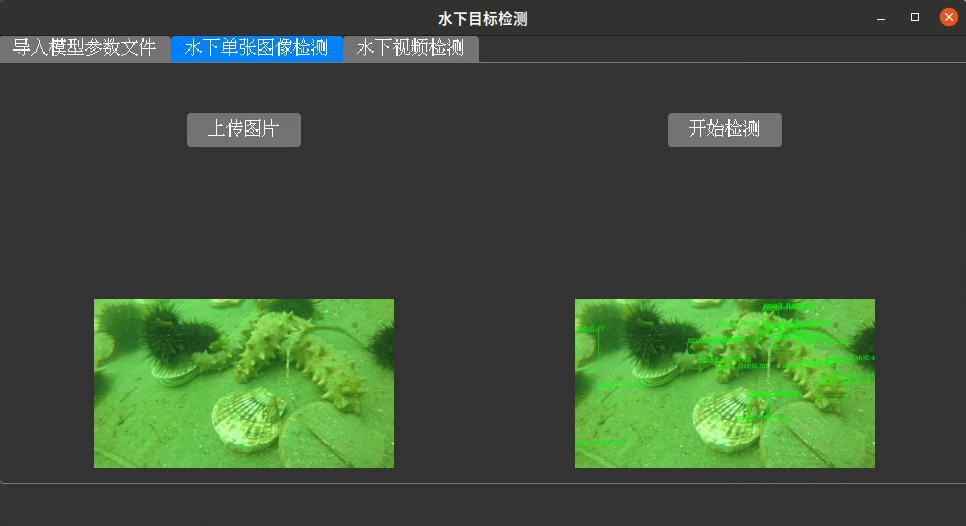

<h1 align="center">项目名称</h1>

<p align="center">
  这是一个研究生电子设计竞赛的参赛作品部分代码，内有目标检测的设计的GUI。


<p align="center">
  <a href="https://github.com/yourusername/project-name">
    
  </a>
  <a href="https://github.com/yourusername/project-name">
    
  </a>
  <a href="https://github.com/yourusername/project-name/issues">
    
  </a>
  <a href="https://github.com/yourusername/project-name">
    
  </a>
</p>

---

## 📚 目录

- [功能](#功能)
- [安装](#安装)

---

## 关于项目

这里列出项目的主要功能：

- 🔧 **简单易用**：需要修改目标检测模型的地址。
- 🌍 **平台**：运行在ubuntu平台。

## 安装

按照以下简单步骤安装项目：

1. 克隆仓库：

   ```bash
   git clone https://github.com/yourusername/project-name.git


